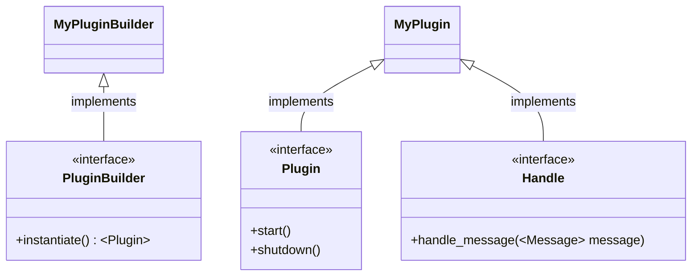
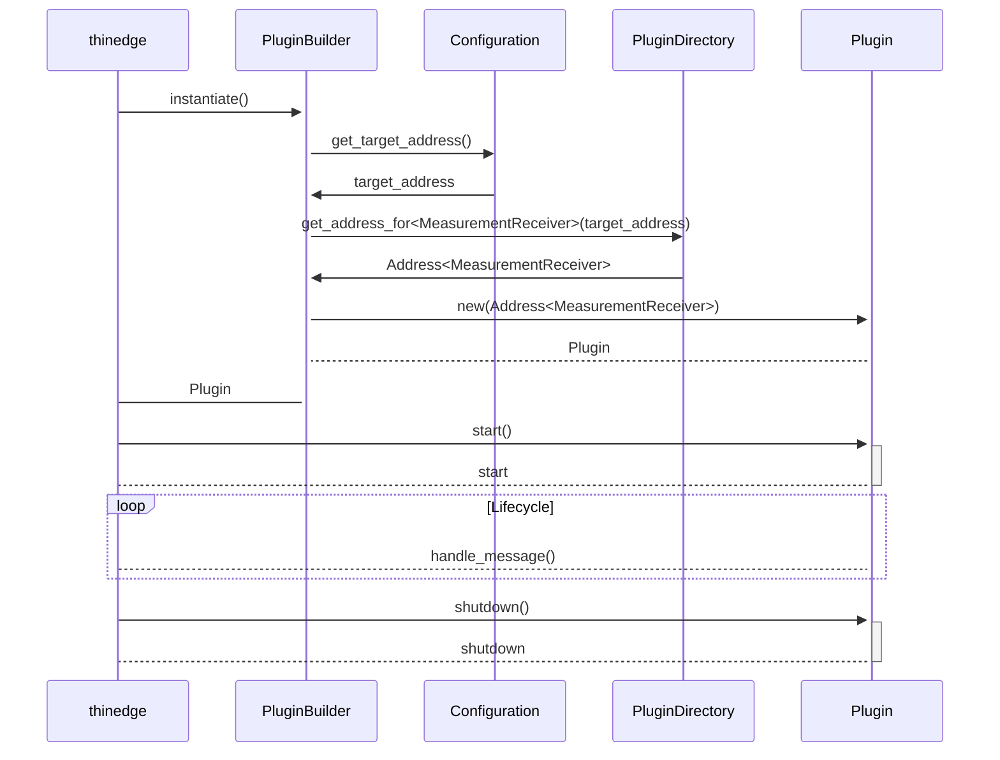

# Thin Edge API

thin-edge is made up out of "Plugins"[^1] which pass messages to eachother.
These plugins run on a "Core", which handles the message passing and the plugin
lifecycle.
This crate defines the interfaces a plugin author needs to implement so that a
plugin can be built into thin-edge.


## What a Plugin is

A Plugin is a piece of code that covers some usecase. That usecase has to be
exposed to the thin-edge.io ecosystem with the following functionalities (from a
high level):

* There's a function to "instantiate" a `Plugin`
* There's a function to "start" a `Plugin`
* A plugin can expose a number of API endpoints that it can receive messages on
* There's a function for cleanly shutting a `Plugin` down

The implementation of what we call the "core" of thin-edge.io is then
responsible of instantiating a plugin upon user request, start it, and send it
messages or forward messages the plugin emits to other plugins.

Messages are just objects that are defined via Rust structures. See below for
more information.

If shutdown of thin-edge.io is requested, the core is also responsible of
shutting a plugin down.

The core is responsible to protect each plugin from crashes of other plugins and
guarantee safe operation of all plugins in the ecosystem.


## API to implement

To implement a Plugin and bring functionality to the thin-edge.io ecosystem,
the following API endpoints need to be implemented:

* The `PluginBuilder` trait defines the interface that will be used to
  instantiate a `Plugin`
* The `Plugin` trait defines the interface that is used to start the
  instantiated `Plugin` and to shut it down
* The `Handle` trait defines the interfaces a `Plugin` instance can receive
  messages on. This trait can be implemented multiple times for each `Plugin`,
  one time for each message type this plugin is able to receive.

The following (simplified) diagram should describe this in a visual way:

<!--
the "aquamarine" crate does not yet support rendering this in rustdoc.
See: https://github.com/mersinvald/aquamarine/issues/19
-->


## What a Message is

A message can be anything that is able to implement the `Message` trait.

This trait does not require the message to implement functionality, it just
requires an implementing structure to implement `Debug` and `Send` and some
others.

For example:

```rust
#[derive(Debug)]
struct Value(f64);

impl Message for Value {}
```

## How messages are send

Messages can be send between plugins, but can also be send to the core of
thin-edge.io and to the plugin itself (a Plugin can send messages to itself).

To be able to send a Message, an `Address` of that Plugin needs to be known.
That `Address` can be fetched during the instantiation of the Plugin. The
`PluginBuilder::instantiate()` function gets a reference to a `PluginDirectory`.
That `PluginDirectory` is basically an "address book", that can be asked for
addresses to other plugins, by specifying their name.
That name usually has to be configured.


## Plugin lifecycle

The above illustrated how a plugin lifecycle looks like. The following diagram
is here to visualize the words from above (minus some details that are not
required for understanding the grand scheme of things):




[^1]: Name is subject to change.

