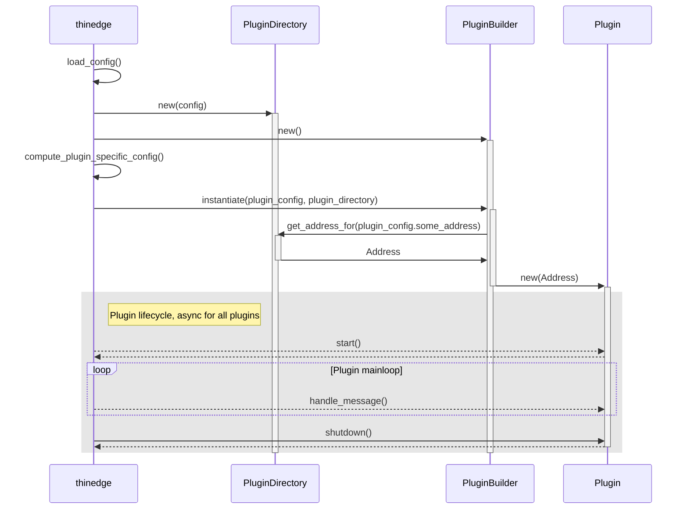

# tedge_core

This is the "core" implementation of tedge.

This means that this crate provides a runtime implementation that is used to
orchestrate the running of the individual components of thin-edge.io, called
"Plugins".

This crate can then be used in a very minimal CLI implementation to start up a
process and run all the domain specific parts of thin-edge.io.

## Responsibilities of this crate

This crate has several responsibilities:

* Reading and parsing the configuration of thin-edge.io
* Using the PluginBuilders to instantiate the individual plugins
  * with their respective configuration
  * giving them the opportunity to retrieve addresses of other plugins, to be
    able to send messages to those
* Start the instantiated plugins
* Ensure that messages are passed concurrently between plugins
* Shutting of the running plugins

All of the above is done with crash-safety in mind. So if one plugin crashes in
either `start`, during the handling of a message or in `shutdown`, this must
never impact other running plugins or the rest of the application.

With a very high abstraction level, the crate approximately does the following
(although many things in here are executed completely asynchronously and some
details are missing):

